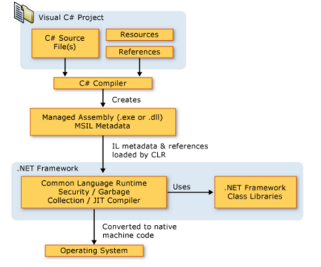

# Introduction to .NET

## Overview of the .NET Architecture & C#

### Compilation

C# is a modern object-oriented programming language derived from C/C++. It is considered an interpreted language because developers write commands using C# syntax and during compilation, it is converted to code that the computer understands, called bytecode.

<div class="definition note">We use a <span>compiler</span> to transform human-readable source code into a language the computer can understand, known as object code.</div>

### .NET Core framework

During this first module, all of our programs will be written using a language called C#. C# programs run on the **.NET Core** framework.

<div class="definition note">A <span>framework</span> is a collection of code that programmers utilize to build a program or application.</div>

Microsoft developers created the .NET Framework in 2000. Originally, the project was 80% of Microsoft's R&D budget. Two programmers led the team.

The .NET Core framework—not to be confused with the capitalized .NET Framework—was released in 2016, and is a free and open source implementation of the original .NET Framework. Microsoft continues to improve both versions, releasing new updates regularly.

The framework provides developers access to a collection of code files, called a **class library**. There are over 4,000 different capabilities provided within this collection including security, user interface, network communication, and database interaction.

### Common Language Runtime (CLR)

Programs that we create are executed within a common language runtime (CLR). The common language runtime supports multiple languages because the output result of compilation is bytecode.

<div class="definition note">A <span>runtime</span> environment is a virtual environment that allows a program to send instructions to the computer's
processor. Other runtimes that we may be aware of include <em>Adobe Flash Player</em> or <em>Microsoft PowerPoint Viewer</em>.</div>

Hierarchical representation of a .NET application written using C#.



## Introduction to Visual Studio

Only hardcore developers work within a text editor and many choose to work within a integrated development environment.

<div class="definition note">An <span>integrated development environment</span> (IDE) is the one-stop shop that developers use to write, compile, test, and debug code.</div>

IDEs help to:

* organize code into projects and solutions
* provide immediate feedback on syntax errors
* code assistance through IntelliSense
* support suspending a program to step through and debug code

<div class="definition note">A <span>project file</span> includes a reference to one or more code files that belong to a module.</div>

<div class="definition note">A <span>solution file</span> includes a reference to one or more projects. </div>

### Getting Around Visual Studio

Walk the students through the following in Visual Studio:

1. Creating a new Console Application
2. Writing the Hello World Application in the Console Application
3. Building an application using (**`Ctrl+Shift+B`**), Build Menu, or run an application using **`Ctrl+F5`** or **`Debug` &rarr; `Start Without Debugging`**
4. Using IntelliSense. Tab / Enter auto-completes.
5. Parentheses, curly braces, quotations auto-close

## Hello World

Write the Hello World program in the IDE.

1. Create an empty solution and a file called `HelloWorldClass.cs`
2. Open the file and write the contents of the below code snippet.
```csharp
using System;
class HelloWorldClass
{
    static void Main(string[] args)
    {
        //Prints out Hello World
        Console.WriteLine("Hello World");
    }
}
```

| Code | Description |
|------|-------------|
| `using System` | Indicates to the compiler we need to use code from the **System** namespace |
| `class HelloWorldClass` | C# programs are made up of one or more classes which hold program code |
| `static void Main(string[] args)` | The entry point when programs that we write are executed run |
| `{...}` | Encloses a set of commands. For each opening brace there is a closing brace |
| `//Prints out Hello World` | Comments to either provide information to the developer or to temporarily make code not run while testing |
| `Console.WriteLine("Hello World");` | Command to write code out to the console |

**Challenge yourself to write code and minimize the usage of the mouse**