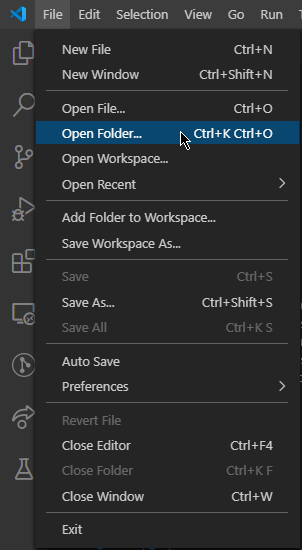
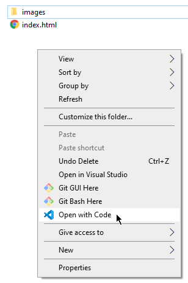
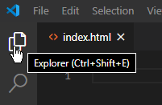
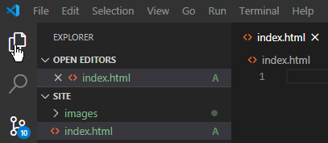
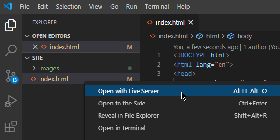
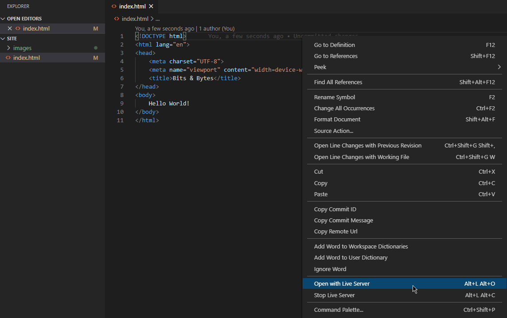
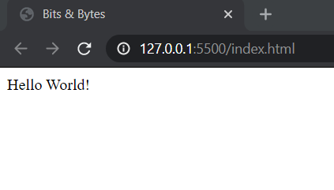
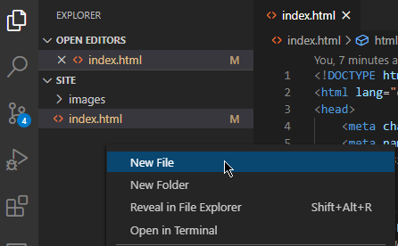
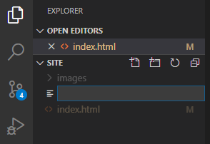

# Intro to HTML and CSS - Lecture Notes

## Getting started

In this lecture, you'll use the "Live Server" extension for Visual Studio Code, which is pre-installed on the students' laptops. To use this extension, you'll have to open the `site` folder in VS Code, instead of opening individual files. Walk through this with the students in one of the following two methods:

1. Open from VS Code (all platforms):
  a. Open VS Code normally from Start menu, Dock, or desktop shortcut.
  b. Open the `File` menu and select `Open Folder`.
  c. Navigate to the folder you want to open, and click `Select Folder`.
  

2. Open from Windows Explorer (Windows only):
  a. Navigate to the folder you want to open.
  b. Right click anywhere that's not a file or folder.
  c. Select `Open with Code` from the context menu.
  d. 

## Starting code

When you open the folder, you'll see a blank `index.html` and a file explorer on the left. If you or a student doesn't have the left pane, click the "Explorer" icon on the left bar.





Using the built-in Emmet tool, type `!` and press `Tab` to generate an HTML template. Take some time to look at this generated code with the students, talking about some of the following points:

- HTML elements
  - `<head>`: Metadata about the document and links to other files such as CSS and JavaScript files. You'll add a CSS file during this lecture.
    - Students don't need to understand the `<meta>` tags that are part of the generated code, but you can tell them it helps browsers display the content.
  - `<title>`: Sets the title of the page, which displays in the browser's tab or title bar. Also used when bookmarking the page. You can change this now to the name of the restaurant, "Bits & Bytes."
  - `<body>`: The actual content of the page; includes text, images, and media files.

- HTML document structure
  - `<!DOCTYPE html>`: Tells the browser this is an HTML file and to treat it as such. Although most browsers render HTML without it, it's a best practice to always include it for interoperability.
  - `<html>`: The "root" element. Every other element on the page must be be a "descendant" of this element, meaning it's nested underneath, like a folder inside another folder.
    - `<head>` and `<body>` are child elements of the `<html>` element.
    - `<head>` has three child elements: two `<meta>` elements and a `<title>` element.

## Live Server

While there shouldn't be any issues with getting Live Server running on everyone's machine, it's best to get any troubleshooting out of the way before going deeper in the lecture.

To demonstrate how Live Server works:

- Type `Hello World!`, or your choice of test text, in the `<body>` element of the page. Optionally, you can wrap this text in `<p>` tags.
- Open Live Server in one of two ways:
  - In the VS Code file explorer, right-click the file under `site`—not the entry under "Open Editors." It won't work there. Choose the first option: "Open with Live Server."
  - 
  - Or right click anywhere in the file editor, and select "Open with Live Server."
  - 
- A new browser window appears with the test text.
- 
- Go back to VS Code, change the text, and hit "save."
- Show that the browser automatically refreshes the page with the change.

When you're done with that, you can remove the test text.

## Creating header content

Tell the students you want to put the name of the restaurant, "Bits & Bytes", in large font and the top of the site. Ask for suggestions from the students about what kind of element you can use for that. You're looking for a `<h1>`. 
>Note: If you get the answer `<header>`, you can explain you're looking for a tag just for the heading *text* right now, and you'll come back to `<header>` in a bit.

Add the `<h1>` and show the page in the browser:

```html
<body>
    <h1>Bits & Bytes</h1>
</body>
```

Now, it needs a tagline. Ask for suggestions about the element and see if you get `<h2>` as an answer. If a student doesn't suggest an `<h2>` ask "why not an `<h2>`?"

Take a moment to explain the heading elements aren't just a "size" that you want the text to display at. They bear a certain significance within the document. Each element represents a different level of content in the document. The `<h1>` represents the main heading, `<h2>` represents subheadings, and `<h3>` represents sub-subheadings. This is important for two reasons:

- **Structure**
  - Headings outline the content of the page. They organize your content in a way that makes sense. 
  - Heading levels are sequential `<h2>`s follow an `<h1>`, and `<h3>`s follow an `<h2>`.

- **Semantics**
  - The "role" or "meaning" of something. Just as you give program variables meaningful names, the HTML elements you choose also have meaning.
  - An `<h1>` means "a top level heading on your page."
  - You could use CSS to make any element "look" like an `<h1>`, but it doesn't have the same semantic value.
  - Why are semantics important?
    - Screen readers help visually impaired users read a page, and they can use elements as "sign posts" to help navigate around it.
    - Search engines give different consideration to content based on the element's semantic meaning.
  - HTML tags are markup that add meaning to text. Choose them based on their semantic meaning, not their default styling. Presentation—meaning how it appears—is the sole responsibility of CSS.

Since the tagline doesn't need any special meaning applied to it, a `<p>` element is sufficient. Below the `<h1>`, add the tagline. Feel free to replace the tagline with one of your own:

```html
<body>
    <h1>Bits & Bytes</h1>
    <p>Welcome to the internet's best restaurant</p>
</body>
```

## Semantic elements

You've decided that you want to show the menu on the homepage. You've also decided an `<h2>` is acceptable for the header of the menu content. It's a subheading under the restaurant's name.

The restaurant serves lunch and dinner, so `<h3>`s make sense for the headers of those sections:

```html
<body>
    <h1>Bits & Bytes</h1>
    <p>Welcome to the internet's best restaurant</p>

    <h2>Menu</h2>
    <h3>Lunch</h3>

    <h3>Dinner</h3>

</body>
```

Save the page and show the browser window. You can point out how the `<h3>`s are smaller than the `<h2>`s, which is also smaller than the `<h1>`. However, remind students again to select elements based on their semantic meaning, not presentation. CSS can alter this default display.

You know that the restaurant offers several dishes and can see this might become an organizational headache. It's always a good idea to start with a good organization of your code. That's why you use folders and namespaces. So before you add any more content, maybe it's a good time to organize it.


Return to the `<h1>` and `<p>` tag at the top of the `<body>`. Explain that these two elements make up the header of the page, but on their own they mean "a top level heading" and "a paragraph." Wrap the two elements in a `<header>` tag:

```html
<body>
    <header>
        <h1>Bits & Bytes</h1>
        <p>Welcome to the internet's best restaurant</p>
    </header>

    <h2>Menu</h2>
    <h3>Lunch</h3>

    <h3>Dinner</h3>
</body>
```

Now, semantically, these two make the header of the page. Save the page and refresh. Show the students it doesn't look any different. `<header>` is a semantic element, meant for organizing content, not for presentation. Remember: presentation is the responsibility of CSS.

Before adding more content, there are some other semantic elements useful for organization: `main` and `section`.

Add a `<main>` element around the `<h2>` and `<h3>`s:

```html
<body>
    <header>
        <h1>Bits & Bytes</h1>
        <p>Welcome to the internet's best restaurant</p>
    </header>

    <main>
        <h2>Menu</h2>
        <h3>Lunch</h3>

        <h3>Dinner</h3>
    </main>
</body>
```

Like the `<header>` element, the `<main>` element doesn't add anything to the presentation—it's for organization. The `<main>` element is for the "main" part of the content or key focus of the page.

The `<section>` element represents a standalone section and can further organize this content. Wrap a `<section></section>` around the Lunch and Dinner headings:

```html
<body>
    <header>
        <h1>Bits & Bytes</h1>
        <p>Welcome to the internet's best restaurant</p>
    </header>

    <main>
        <h2>Menu</h2>

        <section>
            <h3>Lunch</h3>
        </section>

        <section>
            <h3>Dinner</h3>
        </section>
    </main>
</body>
```

## Add images

It's time to add some content to the lunch and dinner menus. No restaurant menu would be complete without some pictures of the dishes. There are some images in the `images/menu/lunch` and `images/menu/dinner` folders.

Under the "Lunch" heading, add a `<p>` element for "Full Stack Sandwich":

```html
<section>
    <h3>Lunch</h3>
    <p>Full Stack Sandwich</p>

</section>
```

### Attributes

So far, all the elements you've added to the page—except the VS Code generated code—haven't had any attributes. But you need at least one for an `` tag, so take a moment to talk about attributes:

- An attribute is piece of code that's included between the angle brackets.
- Attributes are often used to "extend" a tag by changing its behavior or providing metadata.
- Attributes almost always take the form of `name="value"`—there are a few shorthand properties that you can omit the value, but it's a good idea to include the value.

### File paths

Back to the HTML, start an `` element underneath `<p>Full Stack Sandwich</p>`. Before closing the tag, tell the students you need some way to identify the image you want shown. Type `src=`—tell the students this is the name of the attribute, and it's identifying the "source" of the image file. Complete the image tag with the path to the full stack sandwich image:

```html
<section>
    <h3>Lunch</h3>
    <p>Full Stack Sandwich</p>
    
</section>
```

Take a moment to discuss file paths with the students. This is a "relative" path, meaning it's relative to the location of the HTML file. The browser looks at the path, knowing the location of the HTML file it's rendering, and looks for the file path from that location.

Now, you can open Windows Explorer or Finder, and show the `index.html` that you've been working on, and travel the path of `images/menu/lunch/` to find `full-stack-sandwich.png`. There's an example of an absolute path at the end of the notes.

The students may also notice that there's no closing `</img>` tag. You can tell the students that some elements, like images, are "self-closing", meaning that you don't need a closing tag, but you place a space and a slash at the end of the tag: ``

There are three other menu items and images. If you want to continue walking through these with the students, that's okay. If you think you may run out of time, you can copy and paste this code since there's nothing unique to it:

```html
<section>
    <h3>Lunch</h3>
    <p>Full Stack Sandwich</p>
    
    <p>Universal Serial Burger</p>
    
</section>

<section>
    <h3>Dinner</h3>
    <p>Rack of RAM</p>
    
    <p>Vegetable Array</p>
    
</section>
```

## CSS

With the menu items and images in place, save the code and show the web page in the browser. It looks "okay", but those images are big and vary in size. Using CSS, you can set the images to be the same size.

In the VS Code file explorer pane, right click in the empty space and select "New File":



You're prompted to enter a name for the file:



Name the new file `styles.css`. VS Code automatically opens the file after you name it.

>Note: if you'd rather put the CSS in its own folder to reinforce best practices, that's okay. Adjust the path when you insert the `<link>` tag in the HTML.

Recap for the students that CSS rules consist of a "selector" which, for now, is the HTML element that you want to style, and one or more styling declarations, which consist of a property name and a value.

Start an empty CSS rule targeting `img`:

```css
img {

}
```

This is the selector. This CSS rule affects all `` elements on the page. For the images, set the `height` property to `200px`:

```css
img {
    height: 200px;
}
```

### Link CSS to HTML

However, before adding more CSS rules, you need to link to it from the HTML. Similarly to declaring a path to an image, you also need to declare a path to your CSS file. Back in `index.html`, add a `<link>` tag anywhere in `<head>`.

A `<link>` tag requires two attributes: `rel` and `href`. These stand for the "**rel**ationship" to the file, and the "**h**yperlink **ref**erence" to the file. For CSS files, the `rel` is `stylesheet`, and `href` is the path to the CSS file:

```html
<head>
    <title>Bits & Bytes</title>
    <link rel="stylesheet" href="styles.css" />
</head>
```

Like the images before, this is a "relative" path, but it can also take an absolute path.

With the CSS and the `<link>` element in place, the browser now shows you the resized images.

### Font-family

If you want to change the font for an element or a page, you use the `font-family` property. This rule targets the `<body>` element—even though there's no text directly in the `<body>`, the style "cascades" to the elements that are "descendants" of the element in the selector.

```css
body {
    font-family: Arial, Helvetica, sans-serif;
}
```
It's typically a good idea to use "web safe" fonts, meaning fonts that almost every internet device has. However, there are ways to specify fonts to download from web font providers.

### Font-size

By default, `<h1>` elements typically render at `32px` (technically it's `2em`, but `em` is covered later this week). If you want to change the size of your `<h1>`, you use the `font-size` property:

```css
h1 {
    font-size: 32px;
}
```

### Color

You can change the color of text. This example shows using multiple declarations for an element:

```css
h1 {
    font-size: 32px;
    color: cornflowerblue;
}
```

`color` can take a keyword—currently there are around 140 supported color names—but it can also accept a six-digit hexadecimal value, for example, `#3CB371`. Try that value and show the students.

If you have time, you can explain that the hex values represent values for Red, Green, and Blue, often called RGB, with two digits each. The values go from `00` to `FF`. You can tweak the numbers to show the color changing in the browser.

## HTML form

In the VS Code file explorer pane, create a new file named `reservations.html`. Using the built-in Emmet tool, create the HTML template by typing `!` and pressing `Tab`. Change the `<title>` to "Reservations." If you want to copy and paste the `<header>` from `index.html`, you can.

In the body, create a `<main>` element, and an `<h2>` inside it with the text "Reservation Form":

```html
<body>
    <header>
        <h1>Bits & Bytes</h1>
        <p>Welcome to the internet's best restaurant</p>
    </header>

    <main>
        <h2>Reservation Form</h2>

    </main>
</body>
```

You'll create a simple form for users to submit reservations for the restaurant. Explain to the students that `form`s are one way to submit data from the client to the server. They've likely encountered forms on the web when logging into websites, posting on social media, or completing an e-commerce purchase.

Create a `<form>` tag after the `<h2>`. Tell the students that forms require at least two attributes—`method` and `action`. The `method` attribute takes one of two values, `GET` and `POST`. These are the same `GET` and `POST` that they saw in the previous module regarding client-server.

Notes on `GET`:
- Appends form data into the URL in name/value pairs.
- Never use `GET` to send sensitive data since that data is present in the URL.
- It's useful for form submissions where a user wants to bookmark the result.
- `GET` is better for non-secure data, like query strings for a search engine.

Notes on `POST`:
- Appends form-data inside the body of the HTTP request (data isn't present in the URL).
- Form submissions with `POST` don't support bookmarks.
- Just like `POST` methods on the server, reserve it for "creating" things like reservations.

The `action` attribute is the URL where the form sends its data, like an API endpoint. Since you don't have an actual endpoint, you'll use a placeholder URL—this URL is an example of an "absolute" path.

An absolute path differs from a relative path by the leading `/` in the URL. Absolute paths are useful when the path for the page is different from a referenced resource. Absolute paths can also be a full URL, like `https://example.com/api/reservation`:

```html
<main>
    <h2>Reservation Form</h2>
    <form method="POST" action="/api/reservation">

    </form>
</main>
```

### Form elements

Like other elements, `<input>` can accept attributes, and this where the student can see a real change in behavior based on the value. Start with `<input type="text" />`:

```html
<form method="POST" action="/api/reservation">

    <input type="text" />

</form>
```

Show the students the form in the browser, which is just a text box. Now go back to the HTML and change the `type` value to `checkbox`:

```html
<form method="POST" action="/api/reservation">

    <input type="checkbox" />

</form>
```

Save and show the page again. Now, it's a checkbox. All you did was change the attribute and you got a different behavior. You'll show the students different input types in a minute.

### Form labels

Form elements typically require a label and some sort of input. You could do without the label, but users wouldn't know what the form inputs are for. Also, if you use a label instead of text, the user can click the label to interact with the form element—for example, getting focus in a textbox or toggling a checkbox. A `<label>` element takes one attribute—`for`—which is the `id` of the `<input>` element. So you must give an `id` to your inputs:

```html
<form method="POST" action="/api/reservation">

    <label for="reservationName">Name:</label>
    <input id="reservationName" type="text" />

</form>
```

Take a moment to note to the students that `id`s must be unique on the page. While repeated `id`s might not prevent the display of the page, they can lead to unexpected behavior with CSS and JavaScript.

See how `for` and `id` are the same values. Save and show the page in the browser again. Clicking on the "Name" label sets the focus on the text field. If you want, you can remove the label (just leave "Name:") and show that the behavior isn't the same.

### Form input names

It's important for `input` elements to have a `name` attribute. This is the name of the value that gets sent to the server. Although there's no endpoint to use to demonstrate this, stress the importance of this and add a `name` attribute to the input:

```html
<form method="POST" action="/api/reservation">

    <label for="reservationName">Name:</label>
    <input id="reservationName" name="reservationName" type="text" />

</form>
```

### Form input types

Now, the students can see some other input types. Provide the label and see if the students can suggest the type of input:

```html
<form method="POST" action="/api/reservation">
    <div>
        <label for="reservationName">Name:</label>
        <input id="reservationName" name="reservationName" type="text" />
    </div>
    <div>
        <label for="numberOfGuests">Number of guests:</label>
        <input id="numberOfGuests" name="numberOfGuests" type="number" />
    </div>
    <div>
        <label for="reservationDate">Date:</label>
        <input id="reservationDate" name="reservationDate" type="date" />
    </div>
    <div>
        <label for="reservationTime">Time:</label>
        <input id="reservationTime" name="reservationTime" type="time" />
    </div>
    <div>
        <label for="specialOccasion">Special Occasion:</label>
        <input id="specialOccasion" name="specialOccasion" type="checkbox" />
    </div>
    <div>
        <input type="submit" />
    </div>
</form>
```

>Note: the `<div>` element wasn't covered earlier in the lecture. Here, it groups the `<label>` and `<input>` elements together. You can explain it as a sort of "generic container" since you might not need precise semantics for each grouping here. It also has the benefit of putting each grouping on a new line.

The `number` input forces the value to only be numeric (try typing letters in the field), and includes a "spinner" in some browsers that gives you up and down arrows to change the input.

The `date` input gives a date picker. There's no need for third-party libraries. The same goes for the `time` input.

Lastly, the `submit` type changes the input into a button that's used to "submit" the form.

## Nav and hyperlink

If there's time, you can link the home page and reservation page.

Between the `<header>` and `<main>` elements, add a `<nav>` element. This is another semantic element intended for navigation elements of a site:

```html
<header>
    <h1>Bits & Bytes</h1>
    <p>Welcome to the internet's best restaurant</p>
</header>

<nav>

</nav>

<main>
    ...
</main>
```

On the home page, add a link to the reservation page:

```html
<nav>
    <a href="reservations.html">Make a reservation</a>
</nav>
```

On the reservation, add a link to the home/menu page:

```html
<nav>
    <a href="index.html">View menu</a>
</nav>
```
