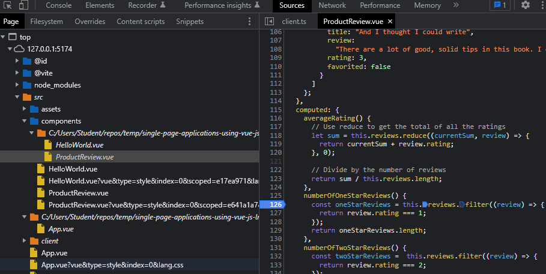

# Debugging Vue in the Browser
## Overview
When `vite` compiles a Vue application it optimizes and modifies the components. Luckily it also creates source maps that map the modified components' code back to the original.

## Debugging

To set a breakpoint in the original, unmodified source code:

- Open the browser's dev tools
- Select the Sources tab
- Each folder that contains components also displays in italics the folder name where the source files reside
- Expand the source folder and select the component
- Click on a line number to set a breakpoint

