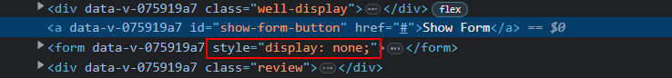

# Vue Event Handling Lecture Notes

The focus of today's lecture is to add to the Product Review component. You'll add new features to the component like the ability to add new reviews and to filter the reviews by their star rating.

## Getting started

First, take a moment to run the Vue component and recap its current features. Have the students follow along by running `npm install` and `npm run dev`.

Go through the code and briefly review the code from the previous lecture, in particular, the fields of the `review` objects in the `reviews` array.

Point out items added to the code for today's lecture:
 - In the `data` section
   - `newReview: {}` - captures the data for the new review form
   - `nextReviewId: 1005` - set to the next unique `id` value
 - In the `methods` section
   - `getNextReviewId()` - used later when creating a new review
 - In the `style` section
   - A new selector `.amount:hover` contains `cursor: pointer;` that visually indicates to users that the star ratings are clickable, although clicking them now has no effect

> Optional: the `averageRating()` computed property has been slightly refactored to round the average rating to two decimal points. If it didn't round, the average rating could overflow its container. It's up to you if you want to point this out to the students too:

```js
averageRating() {
  if (this.reviews.length === 0) {
    return 0;
  }

  let sum = this.reviews.reduce((currentSum, review) => {
    return currentSum + review.rating;
  }, 0);
  return (sum / this.reviews.length).toFixed(2);
},
```

## Add new review

Next, you'll create the form to add a new review. This is a good opportunity to reinforce creating HTML forms.

After the `div`s that display the number of reviews, start a new `<form>` tag. Have the students help you determine the form inputs (`input`, `select`, `textarea`) and see if you can get a student to suggest `<label>` to identify the fields to the user.

As you add each form `input`, add the appropriate `v-model` to bind the value in the `input` to the property in `newReview`:

```html
<form>
    <div class="form-element">
        <label for="reviewer">Name:</label>
        <input id="reviewer" type="text" v-model="newReview.reviewer" />
    </div>
    <div class="form-element">
        <label for="title">Title:</label>
        <input id="title" type="text" v-model="newReview.title" />
    </div>
    <div class="form-element">
        <label for="rating">Rating:</label>
        <!-- NOTE: Use .number modifier here so newReview.rating is a number, not a string -->
        <select id="rating" v-model.number="newReview.rating">
            <option value="1">1 Star</option>
            <option value="2">2 Stars</option>
            <option value="3">3 Stars</option>
            <option value="4">4 Stars</option>
            <option value="5">5 Stars</option>
        </select>
    </div>
    <div class="form-element">
        <label for="review">Review:</label>
        <textarea id="review" v-model="newReview.review"></textarea>
    </div>
    <input type="submit" value="Save">
    <input type="button" value="Cancel">
</form>
```

### The `.number` modifier

Notice that in the starting data, the `rating` is a `Number`. This is important because you use it to determine an average rating and as a filter. However, if you use a generic `v-model` to bind to the `select` value, like `<select id="rating" v-model="newReview.rating">`, Vue assigns the property value as a string. This messes up the average rating calculation because all `rating` values get concatenated, not added together.

 Make sure to use the `.number` modifier for `rating` since you want that saved as a number.

> Note: if you have the time, it may be worthwhile demonstrating to the class the bug that occurs if you leave the `.number` qualifier off of `v-model` for `rating`.

The CSS for class `form-element` already exists in the starting code `<style>` section, to help make the form look nicer.

### Create the `addNewReview` method

Now, you need a way to actually save the data. Go to the `methods` section and add a new method called `addNewReview()`. Emphasize to the students that each review must have a unique `id` for the `v-bind:key` to work properly and efficiently in the `v-for`. Use `getNextReviewId()` to set `newReview.id`.

The intent is for new reviews to appear first in the list. See if you can get the students to suggest `unshift` as the way to add an element to the beginning of an array and what to pass into the `unshift` method:

```js
methods: {
    /*
     * Returns the next review id. Normally, a database would assign a unique id for the review.
     * This code simulates that since there's no database in this example.
     */
    getNextReviewId() {
      return this.nextReviewId++;
    },
    addNewReview() {
        this.newReview.id = this.getNextReviewId()
        this.reviews.unshift(this.newReview);
    },
}
```

The last thing you need to do is go back to the form and add the event handler. Remind the students that `.prevent` prevents the browser from attempting to send a request and refreshing the page:

```html
<form v-on:submit.prevent="addNewReview">
```

Return to the browser and show the students. The form saves the new review, but the fields are still filled out. That's not a great user experience because a user typically expects the form to clear once the form is successfully submitted.

Go back to the `methods` section. You could add some code to the `addNewReview()` method you added, but that might duplicate the behavior the user expects from the "Cancel" button in the form.

Create a new method called `resetForm()`. Because the form uses two-way data binding (`v-model`), just set `newReview` to an empty object:

```js
resetForm() {
    this.newReview = {};
}
```

Then call the `resetForm()` method from `addNewReview()`:

```js
methods: {
    /*
     * Returns the next review id. Normally, a database would assign a unique id for the review.
     * This code simulates that since there's no database in this example.
     */
    getNextReviewId() {
      return this.nextReviewId++;
    },
    addNewReview() {
      this.newReview.id = this.getNextReviewId();
      this.reviews.unshift(this.newReview);
      this.resetForm();
    },
    resetForm() {
      this.newReview = {};
      this.showForm = false;
    },
}
```

Back in the browser, fill out the form again and click the "Save" button. The form now clears after submission.

Now, how do you hook up the `resetForm()` method to the "Cancel" button? See if the students can suggest anything.

You're looking for adding the click event handler to the "Cancel" button:

```html
<input type="button" value="Cancel" v-on:click="resetForm">
```

Back in the browser again, fill out the form, but hit the "Cancel" button instead. The form clears and the data isn't saved.

## Hide the form with `v-if`

Next, you're going to hide the form by default and create a link to show the form. The form hides again after clicking the "Save" or "Cancel" buttons.

Add a new property in `data` called `showForm` and set it to `false`:

```js
data() {
    return {
        // omitted for brevity
        newReview: {},
        showForm: false,
```

Above the form, add a new link on the page that says `Show Form`:

```html
<a href="#">Show Form</a>
```

Tell the students you want to be able to set `showForm` to `true` when clicking "Show Form" and have the form only appear when `showForm === true`. Ask them how to accomplish this.

There are two steps:

* Add a click event handler to the "Show Form" link that sets `showForm = true`.
* Add a `v-if` attribute to the form with the value `showForm === true`.

```html
<a href="#" v-on:click.prevent="showForm = true">Show Form</a>

<form v-on:submit.prevent="addNewReview" v-if="showForm === true">
```

Next, go back to the `resetForm()` method, and set `showForm` to `false`:

```js
resetForm() {
    this.newReview = {};
    this.showForm = false;
}
```

Show the page again. The form disappears and "Show Form" displays. Click the "Show Form" link, fill out the form, and press the "Save" button. The form submits and disappears again.

Lastly, it would be nice if the "Show Form" link disappeared when the form displays. Just as a `v-if` conditionally shows the form, you can use the opposite logic to hide the link.

Add `v-if="showForm === false"` (or `v-if="!showForm"` if you prefer) to the "Show Form" link:

```html
<a href="#" v-on:click.prevent="showForm = true" v-if="showForm === false">Show Form</a>
```
## Hide the form with `v-show`

Open the browser's dev tools and demonstrate how, when you click the "Show Form" link, the link disappears from the DOM and the form tag appears. This is the behavior of `v-if`.

On the form element replace `v-if` with `v-show`. Click the "Show Form" link and "Cancel" button and note that the behavior hasn't changed from a user experience perspective. Show that in the DOM, however, the form element always exists. With `v-show`, Vue adds inline styling to hide the element when the `v-show` condition is false:



As noted in the student reading, `v-show` is preferable to `v-if` if you're going to toggle the visibility of elements because `v-show` requires less processing by the browser.

## _(Optional)_ Replace `v-show` with `v-else`

Since the display of the "Show Form" link and the actual form is an either/or situation, `v-if` can be paired with [`v-else`](https://vuejs.org/guide/essentials/conditional.html#v-else) to always display one or the other:

```html
<a
  id="show-form-button"
  href="#"
  v-on:click.prevent="showForm = true"
  v-if="showForm === false"
  >Show Form</a>

<form v-on:submit.prevent="addNewReview" v-else>
```

When used, `v-else` must be on the element immediately following the element that contains `v-if`.

## Review filtering

Now, it's time to add another piece to this application. You need to ensure that if the user clicks on the counts of the star ratings, the reviews filter to only show those reviews. For example, if a user clicks on the number of one-star reviews, they must only see one-star reviews.

How would you do this? Right now, you can see all the reviews in the display. If you only want to show some of the reviews, you'll need another property to show that list of reviews instead of all of them. If you know what star reviews you want to show, show them. Otherwise, show them all.

First, create a new data variable that holds the filter for the reviews:

``` JavaScript
data() {
    return {
        // omitted for brevity
        newReview: {},
        showForm: false,
        filter: 0,
        ...
```

If the filter is 0, you'll see all the reviews. If the filter is any other number, you'll only see the reviews for that rating.

Next, create a new `computed` property to return these filtered reviews:

``` JavaScript
filteredReviews() {
    return this.reviews.filter(review => {
        return this.filter === 0 || this.filter === review.rating;
    });
}
```

You can now use this new property in the `v-for` for the `div`:
Initially, there is no difference in the view. Because the filter is 0 by default, it shows all the reviews.

Next, set up the text in the rating display to set the filter to the star rating you want. To do this, use a `v-on` on a click:

``` HTML
<div class="well">
    <span class="amount" v-on:click="filter = 1">{{ numberOfOneStarReviews }}</span>
    1 Star Review{{ numberOfOneStarReviews === 1 ? '' : 's' }}
</div>
```

You can do this for all the filters. When you click a number, you'll only see the reviews with that number of stars. When you add a new review, the review is automatically shown in either view.

If you want, you can also set the average review number to show all the reviews again. To do this, set the filter back to 0:

``` HTML
<div class="well">
    <span class="amount" v-on:click="filter = 0">{{ averageRating }}</span>
    Average Rating
</div>
```

> Students may ask when do you use a method versus putting the code in the `v-on`.
>
> `methods` are useful when you have code that you want to execute on an event. However, you can also put code directly in the `v-on`. Why use one over the other?
>
> Putting code in the `v-on` is useful if you're only setting a variable. During Vue development, this makes sense.
>
> You should use `methods` if you need to write more than one line of code or code used in multiple `v-on` bindings. `methods` help to consolidate code in one place and prevent code duplication, which makes maintenance easier.

## Refactoring opportunity

If you still have time, you can walk the students through a refactoring opportunity. The computed properties that display the number of star ratings—like `numberOfOneStarReviews()`, `numberOfTwoStarReviews()`—have duplicated logic and can be refactored.

Create a new method named `numberOfReviews` that takes a parameter `numOfStars`. The logic is similar to what's in the computed properties, except you compare `review.rating` to the `numOfStars` parameter:

```js
methods: {
    getNextReviewId() {
        //...
    },
    addNewReview() {
        //...
    },
    resetForm() {
        //...
    },
    numberOfReviews(numOfStars) {
      const reviewsWithNumStars = this.reviews.filter((review) => {
        return review.rating === numOfStars;
      });
      return reviewsWithNumStars.length;
    },
}
```

Now, the computed properties can call the `numberOfReviews()` method:

```js
computed: {
    //...
    numberOfOneStarReviews() {
      return this.numberOfReviews(1);
    },
    numberOfTwoStarReviews() {
      return this.numberOfReviews(2);
    },
    numberOfThreeStarReviews() {
      return this.numberOfReviews(3);
    },
    numberOfFourStarReviews() {
      return this.numberOfReviews(4);
    },
    numberOfFiveStarReviews() {
      return this.numberOfReviews(5);
    }
```

