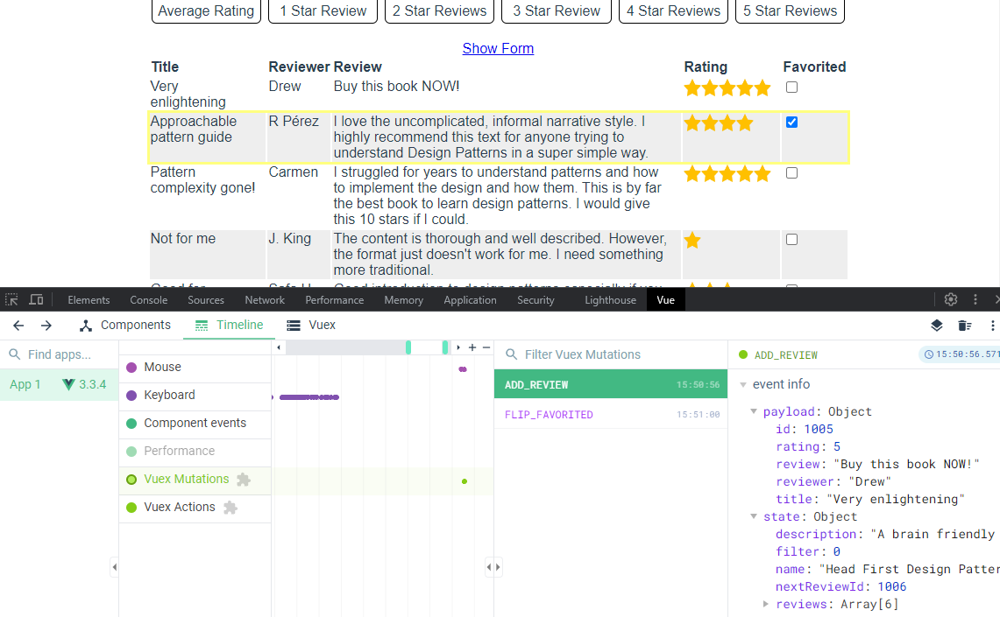
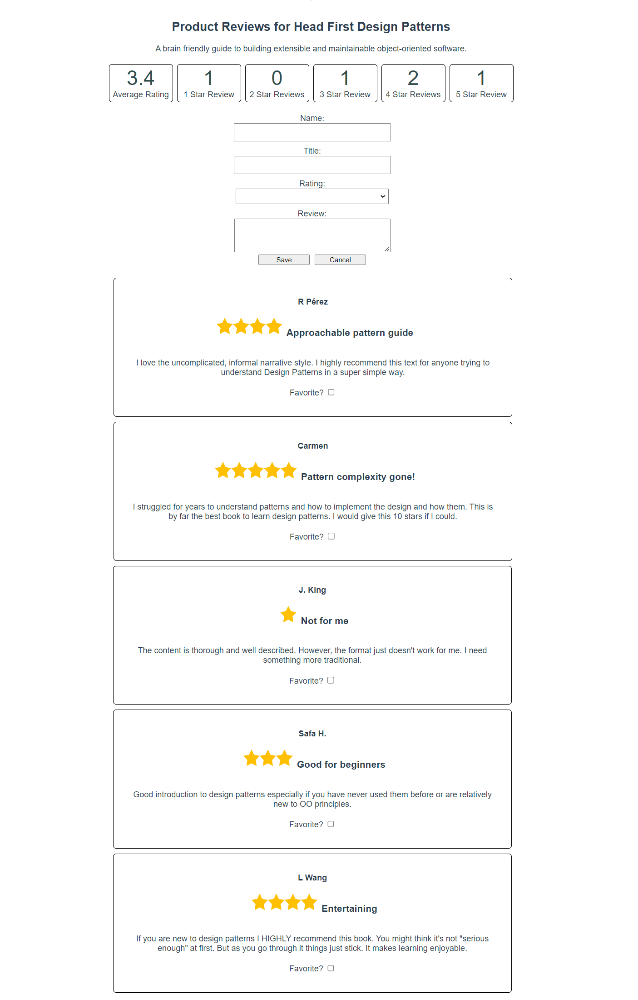
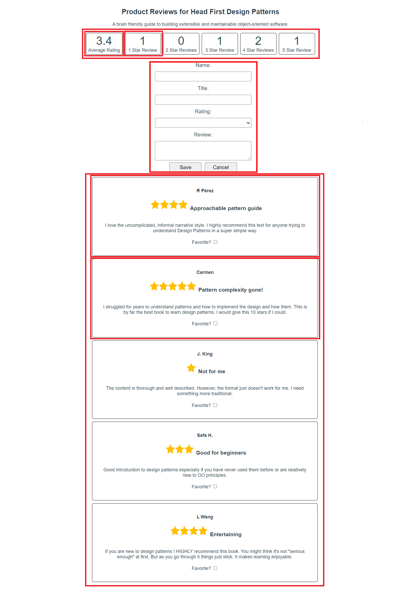
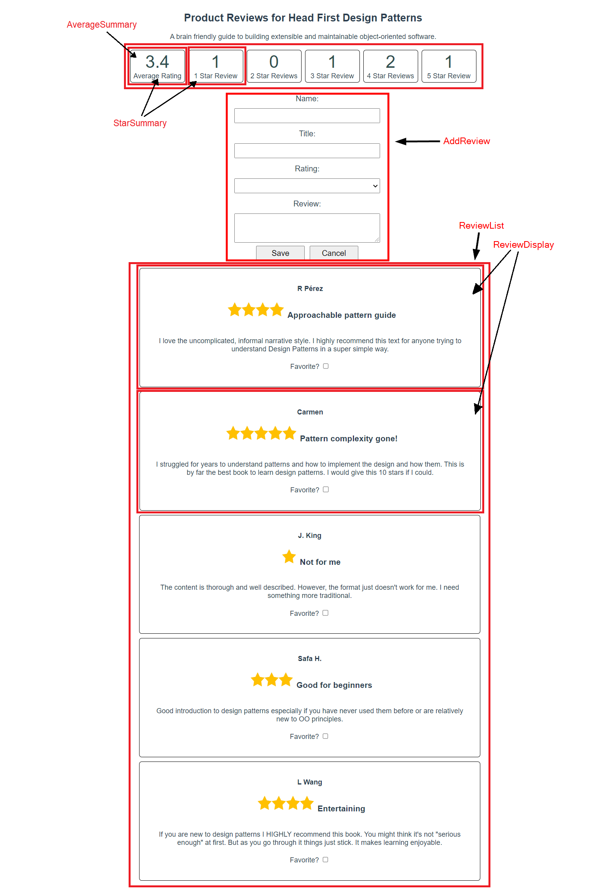
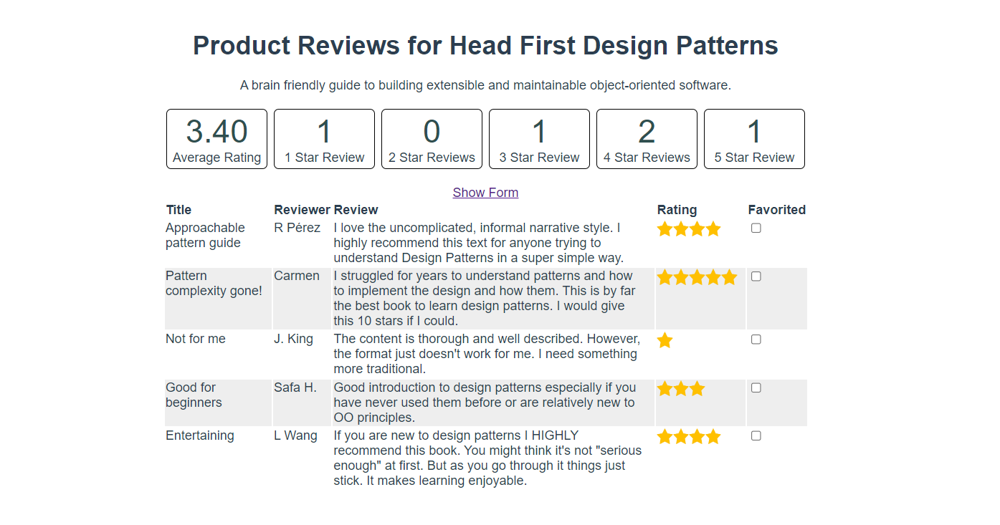

# Lecture Code Walkthrough

## Why mutations

The student reading pointed out that you must make any changes to state by using mutations. Some students—even yourself—might ask "Why?" This section prepares you to answer this question, and any others, that might come up during lecture.

Using mutations is an example of the **Single Responsibility Principle**. As the student reading said, components ideally do only one thing, and mutations are ideally the only place where changes to state occur. If you follow the convention of always changing state with a mutation, then you'll always know where state changes in your application.

Look at this example from the product reviews application. If you're iterating over a list of reviews and want to display a checkbox that favorites the review, how would you do it? Your first response might be to use `v-model`:

```html
Favorite? <input type="checkbox" v-bind:id="'favorite_' + review.id" v-model="review.favorited" />
```

This works, but there's a problem with this approach. If you check or clear the checkbox, you're updating state from the component itself. Now imagine that this checkbox is part of a component that's alongside several other components in your application, each one updating state in their code. If you're trying to troubleshoot an issue where your data—meaning state—isn't correct, you may find yourself looking through a dozen different components and all their methods.

Another benefit of using Vuex, mutations, and the Vue DevTools is being able to view all mutations as they've occurred. As you commit mutations, the Vue DevTools records each one along with a timeline of other events. Now if you need to debug a state problem, you can inspect all the mutations that have occurred:



## Breaking a component into multiple components

In the previous lecture, you saw a single component called `ProductReview.vue` that was responsible for:

- Displaying rating totals
  - Average Rating
  - Number of Stars (1-5)
- Listing Product Reviews
- Displaying Review Details for each Review
- Adding a New Review
- Filtering Reviews by rating
- Marking Reviews as Favorite

The final component `/src/components/ProductReview.vue` from the previous lecture is in the lecture-final and the lecture starting code. This is a great opportunity to see if students can identify how to break this component down into multiple components.

The provided application code already uses the new components, so you can show the students this screenshot for your discussion:



Some expected answers from the students might include:

- Star ratings/filters
  - You could break this down further: 1-5 stars boxes can be the same component, with the star rating passed as a prop
- Add new review form
- List of reviews
  - You can also break this down further with a component responsible for rendering a single review



The provided code includes the following components, but they need some additional code to access the data from the Vuex datastore. You'll walk the students through making these modifications:

- `/src/components/AverageSummary.vue` - Displaying average rating
- `/src/components/StarSummary.vue` - Displaying star totals
- `/src/components/AddReview.vue` - Adding a new review
- `/src/components/ReviewList.vue` - Listing product reviews and filtering by rating
- `/src/components/ReviewDisplay.vue` - Displaying review details for each review

## Starting code

Start by walking through the current application, which already contains the new  components. Make sure to spend enough time in each component so the students understand that the code is essentially what was in `ProductReview`. *The code that interacts with Vuex will be completed during lecture*.

You may also show them this diagram to see which parts of the page went into which component:



### Vuex

Vuex was already added to the application by using `npm install --save vuex@4` and configured in `/src/store/index.js` and `main.js`. You can go into `/src/store/index.js` to look at the current configuration of the store to make sure they understand what `state` and `mutations` are doing.

The `state` section contains most of the same data properties that were in `ProductReview`: `name`, `description`, `filter`, `nextReviewId`, and `reviews`. Properties like `newReview` and `showForm` aren't shared, so they exist only in the component that needs it: `AddReview`.

### AverageSummary.vue

This component is responsible for displaying the average star rating. When clicked, it resets the filter to show all reviews.

In the component, you'll see there's an empty method, `updateFilter()` and a computed property, `averageRating`. The `updateFilter()` method commits a mutation to reset the filter.

The code in the `averageRating` computed property is similar to the code in `ProductReview.vue`, except that `reviews` is an empty array for now. It originally got the reviews from the in-component `reviews` array, but now requires an update to get data from Vuex.

### StarSummary.vue

This component is responsible for displaying the number of ratings for each amount of stars. It's the same component for 1-5 stars.

In the component, you'll see the same empty method, `updateFilter()` and a computed property, `numberOfReviews`. Like `AverageSummary.vue`, the `updateFilter()` method commits a mutation to set the filter.

The `numberOfReviews` computed property is similar to the code that was in the `numberOfReviews` method in `ProductReview.vue`, except that `reviews` is an empty array for now. It originally got the reviews from the in-component `reviews` array, but but now requires an update to get data from Vuex.

Make sure to also point out the use of `props` for this component. The new `rating` prop supports component reuse, allowing multiple component instances with a different star rating.

### AddReview.vue

This component is responsible for displaying the form to add and save a new review. The `addNewReview` method requires an update to commit a Vuex mutation to add a new review.

> Note: In Vue 2 the `newReview` object had to include a 'favorited' property to be reactive. This isn't the case in Vue 3. For more information, see the docs on [Vue Reactivity](https://vuejs.org/guide/essentials/reactivity-fundamentals.html).

### ReviewList.vue

This component is only responsible for iterating over the array of reviews, creating a `ReviewDisplay` component for each item in the array.

The `filteredReviews` computed property of `ReviewList.vue` requires an update to retrieve the filter and reviews from the Vuex datastore.

### ReviewDisplay.vue

This component is responsible for laying out the details of the review.

The `onFavoritedChange` method requires an update to use a Vuex mutation to save a review as a favorite.

> Note: As an instructor, you may find adding the code to get and save data using Vuex a bit repetitive. However, this repetition can be helpful for students and illustrates how Vuex can provide direct access to application data from multiple components.
>
> The following Vue Router unit refactors this code again, consolidating the retrieval of data into the views, removing the repeated data access logic making the code more DRY. While there are other Vuex features that could address this, they go beyond what's taught in the reading. Since the applications are moving toward using an API not Vuex to store data, so use of Vuex to hold this data is only temporary.

### App.vue

In `App.vue`, you can see the `AverageSummary`, `StarSummary`, `AddReview`, and `ReviewList` components, as well as the `<h1>` for the title and a `<p>` for the description, but they're incomplete. These elements also require updates to get data from Vuex.

## Writing code: retrieving data and committing mutations

Run `npm install`, then start the application using `npm run dev`. Visit http://localhost:5173 to access the application.

You won't see much at first:


### App.vue: name and description

Start by revisiting `App.vue` to fill in the title and description. Ask the students what code to add to retrieve the `name` and `description` properties from the Vuex datastore. If it helps to re-open `store\index.js` again, do so.

Also, have them say that you need double curly braces to display the property values. Note that `this` isn't required for accessing `$store` in the `<template>` section, similar to using regular in-component properties:

```html
<h1>Product Reviews for {{ $store.state.name }}</h1>
<p class="description">{{ $store.state.description }}</p>
```

### AverageSummary.vue: `averageRating` and `updateFilter`

Next, work on `AverageSummary.vue`. Start with the computed property `averageRating`. This needs one modification to retrieve the `reviews` array from the Vuex datastore. Ask the students how to do this.

What you're looking for in this case is `const reviews = this.$store.state.reviews;`. Note that you need to use `this` in the `<script>` section.

Now that the `averageRating` property has the reviews, it displays the average score rating again. You can show this in the browser.

Next, you need to set the `filter` property. Previously in `ProductReview`, the `v-on:click` event handlers set the `filter` property in the component. Now, it's part of the data stored in Vuex.

Ask the students, how to change data in Vuex. Can you set it by using `this.$store.state.filter = 0`? Technically, you can, but Vuex doesn't support this, so your application may not behave as expected.

Vuex utilizes mutations so that it can communicate data changes throughout the application correctly. To make a change, you "commit" a mutation to the Vuex datastore. You can make an analogy to committing your code in git. When you commit your code, other developers can access it. Similarly, with Vuex, once you commit a mutation, other components can access the data.

Use the `this.$store.commit()` method to commit a mutation. This method takes two parameters. The first is a string that's the name of the mutation in the `mutations` section of `store\index.js`. The second parameter is the data to change.

Show the students the `mutations` in `store\index.js`. Can the students identify the mutation for updating the filter property?

The answer is `UPDATE_FILTER`. The students may ask you where the `state` parameter comes from. That's automatically supplied to the mutation methods. It gives it access to the Vuex `state` which holds the data.

The solution to setting the `filter` property by mutation is:

```js
updateFilter() {
  this.$store.commit('UPDATE_FILTER', 0);
}
```

### StarSummary.vue: numberOfReviews and updateFilter

In `StarSummary.vue`, the solution for accessing the `reviews` in `numberOfReviews` is the same as `AverageSummary`: `const reviews = this.$store.state.reviews;`.

The `updateFilter` method is slightly different since you can't hard-code a value for the rating. Instead, use the prop `rating` for the number of stars:

```js
updateFilter() {
  this.$store.commit('UPDATE_FILTER', this.rating);
}
```

Now, load the page again in the browser. Point out that all the star review boxes still show zero reviews. Can any of the students figure it out? If they need a hint, tell them to look at `App.vue`. The `rating` prop isn't sent to the components. Bind the `rating` prop in the `<star-summary>` tag:

```html
<!-- This form of v-for loops through i = 1 to 5 (see https://vuejs.org/guide/essentials/list.html#v-for-with-a-range) -->
<star-summary v-for="i in 5" v-bind:key="i" v-bind:rating="i" />
```

> Note: this tag uses a form of `v-for` that assigns to `i` successive values from the range 1 to 5. It's equivalent to `for (int i = 1; i <= 5; i++)` in C# or Java.

Now the star review boxes contain the number of reviews.

### AddReview.vue: addNewReview

The `addNewReview` method saves a new review to the datastore. Previously in `ProductReview`, the `reviews` property referenced data in the component. Now that data is in Vuex. Again, multiple components need to read the `reviews` array—you just saw that in the `AverageSummary` and `StarSummary` components.

Can any of the students identify the missing code? What's the mutation name? What data goes in the second parameter?

The mutation name is `ADD_REVIEW` and the data is `this.newReview`:

```js
addNewReview() {
  this.$store.commit('ADD_REVIEW', this.newReview);
  this.resetForm();
}
```

If it helps, you can show the `mutations` section of `store\index.js` again. `ADD_REVIEW` takes the `review` object, assigns the next available id to it, and adds it to the beginning of the `reviews` array:

```js
ADD_REVIEW(state, review) {
  review.id = state.nextReviewId++;
  state.reviews.unshift(review);
}
```

### ReviewList.vue: filteredReviews

The `filteredReviews` method needs both the `filter` value and the `reviews` array:

```js
filteredReviews() {
  const reviewsFilter = this.$store.state.filter;
  const reviews = this.$store.state.reviews;
  return reviews.filter(review => {
    return reviewsFilter === 0 || reviewsFilter === review.rating;
  });
}
```

Feel free to point out to the students that they don't always need to set a value from the datastore to a variable. The following example uses `reviews` directly from the datastore:

```js
const reviewsFilter = this.$store.state.filter;
return this.$store.state.reviews.filter(review => {
  return reviewsFilter === 0 || reviewsFilter === review.rating;
});
```

### ReviewDisplay.vue: onFavoritedChange

The `onFavoritedChange` method requires an update to commit a mutation to save data to the datastore. This method needs to run when a user clicks the "Favorite?" checkbox. This is reinforcement of event handling from the previous day.

Ask the students how can you run this method when the user checks or clears the checkbox. The answer is the `v-on:change` attribute:

```html
<input
  type="checkbox" v-bind:id="'favorite_' + review.id"
  v-bind:checked="review.favorited"
  v-on:change="onFavoritedChange"
/>
```

> **Note: `v-on` and `v-bind` shorthand**
>
> Now that students have used `v-bind` and `v-on` for a couple days, you may want to show them the shorthand syntax for these directives—`:` and `@` respectively:
> ```html
> <input
>   type="checkbox" :id="'favorite_' + review.id"
>   :checked="review.favorited"
>   @change="onFavoritedChange"
> />
> ```
> While all Tech Elevator code uses the full directive names, much of the code they'll see on the web uses shorthand, so it's a good idea to show students that syntax also.

Now modify the `onFavoritedChange` method. The mutation name is `FLIP_FAVORITED`, and it requires a review. Use the review from `data()`, which you access using `this.`:

```js
onFavoritedChange() {
  this.$store.commit('FLIP_FAVORITED', this.review);
}
```

## Review table and table row components

Now that you've gone through all of the components and the students understand how everything works, it's time to write a few components together. The current application displays the list of reviews in a card-like format. Imagine that you've received a request to create a new table layout for the reviews. When you're done, you end up with something like this:



The final solution has two components:

- `/src/components/ReviewTable.vue`
- `/src/components/ReviewTableRow.vue`

You could build this out in a single component first, and then ask the students how they might further break this down and why. A starter `ReviewTable.vue` component is in the `/src/components` directory and contains some styles to help make the table look nice.

Below is what the component could look like if you put all of the logic into a single component. If you look in the `lecture-final` folder, you'll see how you can split it into two components.

The code uses the [CSS `outline` property](https://developer.mozilla.org/en-US/docs/Web/CSS/outline) to highlight the rows of favorited reviews. `outline` is similar to `border` but with some unique differences.

```html
<template>
    <table>
      <thead>
        <tr>
          <th>Title</th>
          <th>Reviewer</th>
          <th>Review</th>
          <th>Rating</th>
          <th>Favorited</th>
        </tr>
      </thead>
      <tbody>
        <tr v-for="review in filteredReviews" v-bind:key="review.id" v-bind:class="{favorited : review.favorited}">
          <td>{{ review.title }}</td>
          <td nowrap>{{ review.reviewer }}</td>
          <td>{{ review.review }}</td>
          <td class="stars">
            
          </td>
          <td>
            <input
              type="checkbox"
              name="favorite-checkbox"
              v-bind:checked="review.done"
              v-on:change="onFavoritedChange(review)"
            />
          </td>
        </tr>
        <tr v-show="filteredReviews.length == 0">
          <td colspan="5">There are no reviews</td>
        </tr>
      </tbody>
    </table>
  </template>

  <script>
    export default {
      methods: {
        onFavoritedChange(review) {
          this.$store.commit('FLIP_FAVORITED', review);
        }
      },
      computed: {
        filteredReviews() {
          const reviewsFilter = this.$store.state.filter;
          return this.$store.state.reviews.filter(review => {
            return reviewsFilter === 0 ? true : reviewsFilter === review.rating;
          });
        }
      }
    };
  </script>

  <style scoped>
    th,
    td {
      text-align: left;
    }
    td {
      padding-right: 10px;
      vertical-align: top;
    }
    tr:nth-child(even) {
      background-color: rgb(238, 238, 238);
    }
    /*
    Table rows are awkward to apply a border to. outline is a good alternative that provides
    a similar visual effect and doesn't affect the page layout
    */
    .favorited {
      outline: 3px solid rgba(255, 255, 0, 0.5);
    }
    .stars {
      display: flex;
    }
  </style>
```

