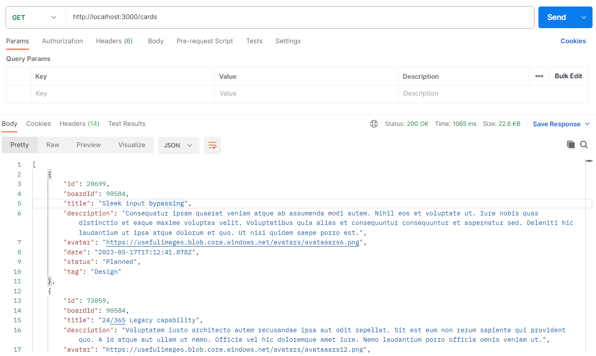
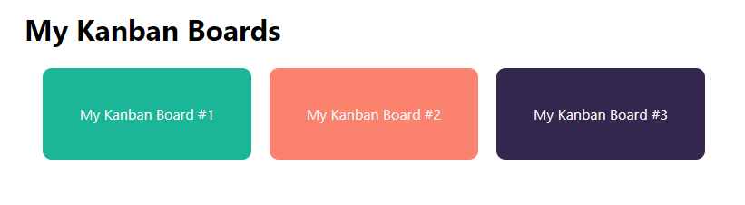
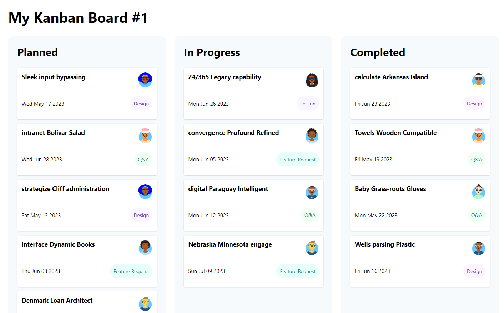
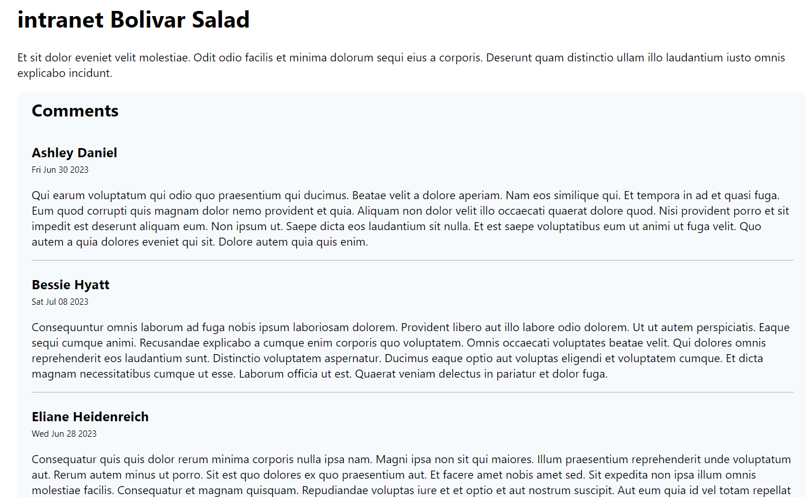

# Web Services (GET) Lecture Code Walkthrough

## Kanban board starting code

To run the application, use the command `npm run dev`. This starts both the local API and the Vue application:

```js
"scripts": {
  "dev": "npm-run-all --parallel json-server start",
  "start": "vite",
  "json-server": "json-server ./db/kanban.json --delay 1000 --routes ./db/routes.json",
  ...
},
```

> Note: The local API returns JSON. This might be a good opportunity to discuss what JSON is and how it's used in JavaScript applications.

### Postman API

Before looking at the UI or code, get the students in the habit of exploring Web APIs using Postman. You can run the application using the starting code. There's an API available at http://localhost:3000/boards:



There are two endpoints that you'll work with:

- GET http://localhost:3000/boards
- GET http://localhost:3000/boards/:id

### Application UI

After you've had a chance to explore the API using Postman, walk through the UI of the existing application. When you visit http://localhost:5173/, you'll see a list of boards:



This is a great time to use the browser network tools to observe traffic between client and Web APIs, and review any questions on Request/Response or how the web works in general.

When you click on any board, you'll see a list of cards for that board:



When you click on a card, you'll see the details for that card along with any comments. This route works, but you won't see any data. This is the component that you'll build out during the lecture. For reference, this is what the card detail screen looks like:



### Application code

Now that you've had a chance to see what the application does, you'll take some time to discuss the code that makes it work.

#### Boards list

To see how the boards list works, look at the router configuration. The `/` path loads `/src/views/HomeView.vue`:

```js
{
  path: '/',
  name: 'HomeView',
  component: HomeView
},
```

This view loads data from the API and displays the boards using the `BoardsList` component. There are several things that you can focus on  in `HomeView`:

- Loading animation
- Importing `BoardService.js`
- `created()` lifecycle hook
- `boardService.getBoards()` service call
- Passing the `boards` list into the `BoardsList` component using props

#### Board view

To see how the board view works, look at the router configuration. The `/board/:id` path loads `/src/views/BoardView.vue`:

```js
{
  path: '/board/:id',
  name: 'BoardView',
  component: BoardView
},
```

This view loads a single board from the API and displays the cards in three sections using the `BoardSection` component. You can show:

- The `created()` lifecycle hook
- The `boardService.getBoard()` service call
- Each column uses the `BoardSection` component
  - Three computed properties filter the `cards` list for individual columns or sections
  - Passing the filtered list of cards from `board` into the `BoardSection` component using props

### Loading animation

The students might ask questions about the loading animation, so feel free to discuss this at any point. The first note is that the local API has a delay built into it. Without such a delay, it would return quickly, and you wouldn't be able to show off the loading animation. You can control that delay in the `json-server` script in `package.json`:

```js
"scripts": {
  "json-server": "json-server ./db/kanban.json --delay 1000 --routes ./db/routes.json",
},
```

It's important to note that this isn't just a "nice to have" feature. It's best practice to let your visitors know that something is happening. If they only see a blank loading screen, they might think your application isn't working.

The animation works by setting a data property on the component that fetches the data. By default, the `isLoading` property is `true`. As soon as you receive data from the API, you set `isLoading` to `false`:

```js
<script>
export default {
data() {
  return {
    boards: [],
    isLoading: true
  };
},
created() {
  boardService.getBoards().then(response => {
    this.board = response.data;
    this.isLoading = false;
  });
}
```

In the template, you display the animated ping-pong loader gif while the `isLoading` property is `true` and the content when it's `false`:

```html
<div class="loading" v-if="isLoading">
  
</div>
<div v-else>
  <!-- content -->
</div>
```

## Card detail

If you click a card from the `BoardSection` component, the router takes you to a URL like `http://localhost:5173/board/39928/card/38399`. In the router configuration, there is a route that matches that path. It loads `/src/views/CardView.vue`:

```js
{
  path: '/board/:boardId/card/:cardId',
  name: 'CardView',
  component: CardView
}
```

The `CardView` view imports and uses the `/src/components/CardDetail.vue` component. You'll be working in the `CardView` view and `CardDetail` component.

### CardView.vue

The view is responsible for:

- Getting parameters from the route
- Calling the API to get data
- Displaying a loading animation while the data loads
- Passing data into components for display

Create a card object in `data()` that represents the details for this card. Then, call the API to get the card details. Import the `BoardService.js` and then use the `created()` lifecycle hook to call the `getCard()` method:

```js
import boardService from '../services/BoardService';

export default {
  // ...

  data() {
    return {
      card: {
        title: '',
        description: '',
        status: '',
        comments: []
      }
    };
  },

  created() {
    boardService
      .getCard(this.$route.params.cardId)
      .then(response => {
        this.card = response.data;
      });
  }
}
```

> Note: This is a great opportunity to dive into synchronous versus asynchronous programming.

In the `<template>`, you'll find the `<card-detail>` component in the HTML. Modify this tag to pass the `card` from the parent into the child component using props:

```html
  <card-detail v-bind:card="card" />
```

### CardDetail.vue

In `CardDetail`, notice there's already a `card` prop. Point out that the previous `v-bind` links to this prop. 

Display the title and description in the template:

```html
<template>
  <div>
    <h1>{{ card.title }}</h1>
    <p>{{ card.description }}</p>
  </div>
</template>
```

If you run the application now, you'll be able to see the title and description of the card.

Next, you'll need to display the comments for this card. You could include the list of comments in the card detail component, but there may be times when you may want to separate cards and their comments. For instance, you may want to display a summary list of cards found after a text search. You'd show each card with its basic information. Users could ask for comments related to any card separately.

Based upon the potential need to display details and comments separately sometime in the future, the project provides students with a starter `CommentsList` component. *For now, the details and comments are displayed together, but the code provides for a future need.*

Continue modifying the card detail component. Start by importing the `CommentsList` component, displaying it in the markup, and passing the `card.comments` as a prop:

```js
import CommentsList from '../components/CommentsList.vue';

export default {
  components: {
    CommentsList
  },
  // ...
}
```

```html
<comments-list v-bind:comments="card.comments" />
```

### Comments list

In the card detail component, you passed the comments as a prop. To accept the data in the comments list component, define a `comments` prop:

```js
export default {
  props: ['comments']
};
```

With the comments prop defined, you can walk through the steps to display the comments:

```html
<template>
  <div class="comments">
    <h2>Comments</h2>
    <div class="comment" v-for="comment in comments" v-bind:key="comment.id">
      <h3>{{ comment.author }}</h3>
      <p class="postedOn">{{ new Date(comment.postedOn).toDateString() }}</p>
      <p>{{ comment.body }}</p>
    </div>
  </div>
</template>
```

> Note that `postedOn` is a `string` in the format of an ISO date (`"2023-05-17T17:12:41.878Z"`). To use JavaScript's date formatting, the property must be of type `Date`. So the rendering code first creates a new `Date` object from the string, then calls `toDateString()` to format it like `"Wed May 17 2023"`.

### Data loading animation and back-to-board link

Since the view is responsible for getting the data, overall layout, and navigation, you'll make these changes to **CardView.vue**.

First, add a link so the user can return to the board without using the **Back** button. Before `<card-detail />`, add the following code. You can use this opportunity to cover `<router-link />` and named routes again:

```html
<div class="board-actions">
  <router-link v-bind:to="{ name: 'BoardView', params: { id: card.boardId } }">Back to Board</router-link>
</div>
<card-detail v-bind:card="card" />
```

Finally, there's a loading animation in the `HomeView` and `BoardView` views. You'll need to add that feature to `CardView` as well. Add a new property called `isLoading` and initialize it to `true`:

```javascript
data() {
  return {
    card: {
      title: '',
      description: '',
      status: '',
      comments: []
    },
    isLoading: true
  };
}
```

In the template, add the markup that displays the ping-pong loader while the `isLoading` property is `true`. Use `v-else` to display the card details if `isLoading` is `false`:

```html
<template>
  <div>
    <div class="loading" v-if="isLoading">
      
    </div>
    <div v-else>
      <div class="board-actions">
        <router-link v-bind:to="{ name: 'BoardView', params: { id: card.boardId } }">Back to Board</router-link>
      </div>
      <card-detail v-bind:card="card" />
    </div>
  </div>
</template>
```

The `lecture-final` project contains the solutions for both `CardDetail` and `CommentsList`.
