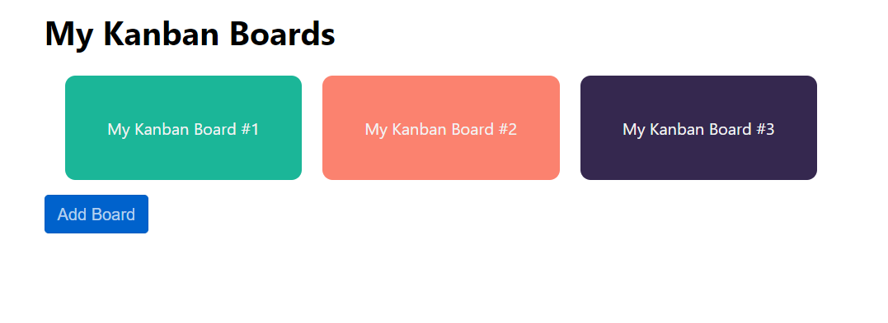
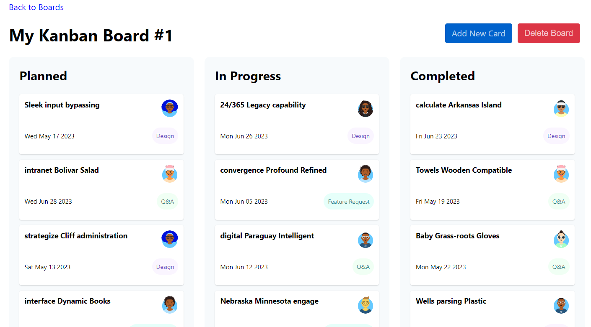
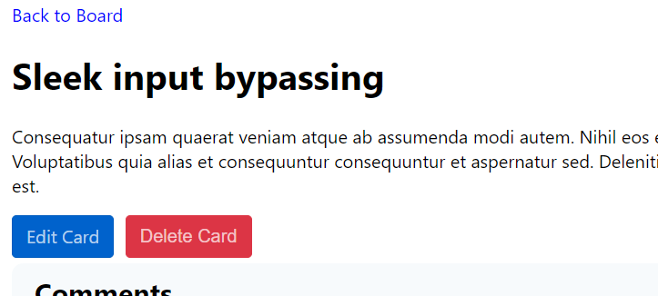
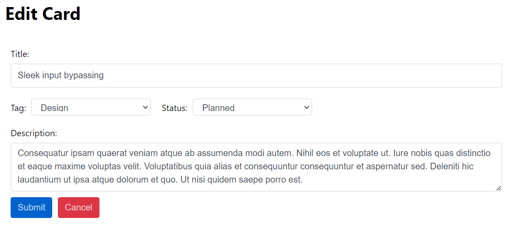
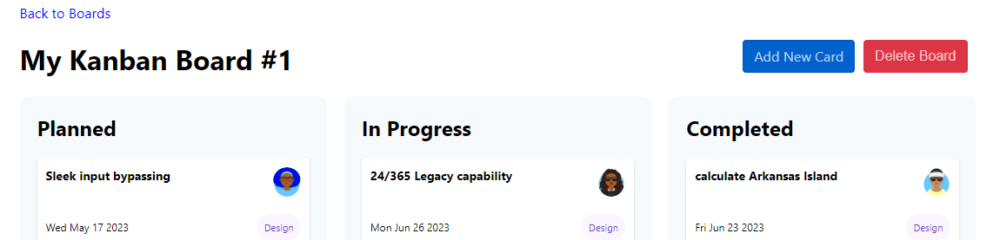

# Web Services (POST and Error Handling) Lecture Code Walkthrough

To run the application, use the command `npm run dev`. This starts both the local API and the Vue application:

```js
"scripts": {
  "dev": "npm-run-all --parallel json-server start",
  "start": "vite",
  "json-server": "json-server ./db/kanban.json --delay 1000 --routes ./db/routes.json",
  ...
},
```

> Note: The local API returns JSON. This might be a good opportunity to discuss what JSON is and how it's used in JavaScript applications, if it hasn't been covered already.

## Application UI

Take a moment to explore the added capabilities of the site. The starter code contains logic to add cards to a board and to delete cards. In the lecture, you'll write code to add a new board and delete an existing board.



---



On the Board view, a new feature exists to add a card to a board. Try adding a new card in front of the students.


Edit and delete are now available on the Card view. Perform both of these functions in front of the students as well.



---



## Application code

Now that you've had a chance to see the new features, you'll take some time to discuss the code that makes it work.

### Service Object

Start by opening `services/BoardService.js`. You'll see the familiar `GET`s from the previous lecture and three new methods: `addCard()`, `updateCard()`, and `deleteCard()`.

Show and explain why these methods use the `.post()`, `.put()`, and `.delete()` methods to add, update, and delete data. Also, point out that the `addCard()` and `updateCard()` methods pass the `card` object to the method and that the `updateCard()` and `deleteCard()` methods need the card ID to identify the resource:

```js
addCard(card) {
  return http.post('/cards', card);
},

updateCard(card) {
  return http.put(`/cards/${card.id}`, card);
},

deleteCard(cardId) {
  return http.delete(`/cards/${cardId}`);
},
```

### Add and edit a new card

Open `components/CardForm.vue`. The `AddCardView` and `EditCardView` views include the `CardForm` component to edit card data. The views use a `card` prop to send card data into the form (either a new, blank card or an existing card to edit). Notice the `data()` property called `editCard`. Here, the `CardForm` component initializes a new card (`editCard`) for the user to edit. `CardForm` must do this because the `card` prop is read-only:

```javascript
data() {
  return {
    // Since props are read-only, don't bind to 'card' directly. Instead, create
    // a new object initialized with the same property values.
    editCard: {
      id: this.card.id,
      boardId: this.card.boardId,
      title: this.card.title,
      description: this.card.description,
      status: this.card.status,
      tag: this.card.tag,
      avatar: this.card.avatar,
      date: this.card.date
    },
  };
},
```

The `<template>` section looks like a typical data form. The form binds several text fields and drop-down lists to the appropriate `editCard` property using `v-model`.

The `submitForm()` method holds the logic for saving the card. 
* First, it calls a method to validate the form. This simple validation checks for a couple of required fields but can be as complex as you need. 
* Then it decides whether this is a new card or an update to an existing card by inspecting the card's `id`. If the `id` is `0`, it's a new card, so it calls `addCard`. 
* In the `.then()` handler method, you see the code that runs for successful responses. Since `addCard()` uses a `POST` method, you expect a `201` response, meaning the resource was "created." If the response code is `201`, the method redirects the user to the board page through `$router.push`.
* If the request isn't successful, the `.catch()` method fires. Re-iterate that the `.catch()` occurs for all non-2xx responses. The `.catch()` method calls the `handleErrorResponse()` method, passing the `error` object and a string representing the action since adding and updating logic may call this method:

```js
if (this.editCard.id === 0) {
  // add
  boardService
    .addCard(this.editCard)
    .then(response => {
      if (response.status === 201) {
        this.$store.commit(
          'SET_NOTIFICATION',
          {
            message: `A new card was added.`,
            type: 'success'
          }
        );
        this.$router.push({ name: 'BoardView', params: { id: this.editCard.boardId } });
      }
    })
    .catch(error => {
      this.handleErrorResponse(error, 'adding');
    });
```

The code in `handleErrorResponse()` is similar to that which the students saw in the student book:

1. First, if there is a `.response`, use it to create an error message.
2. If there's no response, check for `.request`, and set a corresponding error message.
  * This occurs when the client can't reach the server due to an invalid URL or a general network failure.
3. The final `else` means there was a problem creating the request. Bad or malformed data could cause this.
4. The `handleErrorResponse()` method commits a mutation to store the error in Vuex state. The main application component, `App.vue`, displays a message if a `notification` has a value in state:

```html
<div v-bind:class="notificationClass" v-show="notification" v-on:click="clearNotification">
  {{ notification?.message }}
</div>
```

If `editCard.id` has a non-zero value, the user is updating an existing card. Pass the `editCard` object to the `updateCard()` method in the Board Service object.

Since `updateCard()` uses a `PUT` method, you expect a *`200`* response, different from the `POST` method's `201` response. If the response code is `200`, redirect the user to the board page through `$router.push`. Otherwise, call `handleErrorResponse()` to generate and display an error message and commit it to Vuex state.

```js
  } else {
    boardService
      .updateCard(this.editCard)
      .then(response => {
        if (response.status === 200) {
          this.$store.commit(
            'SET_NOTIFICATION',
            {
              message: `Card ${this.editCard.id} was updated.`,
              type: 'success'
            }
          );
          this.$router.push({ name: 'BoardView', params: { id: this.editCard.boardId } });
        }
      })
      .catch(error => {
        this.handleErrorResponse(error, 'updating');
      });
  }
```

### Delete a card

Now you'll review the Delete card logic. Open `components/CardDetail.vue` and scroll to the `deleteCard()` method.

Point out to the students that this method differs slightly from the add and update ones. First, use a JavaScript `confirm()` dialog to ensure the user wants to delete the card. This is a typical UI/UX consideration. `confirm()` returns `true` or `false`. Delete the card only if `confirm()` returns `true`.

If the `boardService.deleteCard()` method is successful, commit a mutation to set the `notification` value in Vuex state. Note that `type: 'success'` allows `App.vue` to style success messages differently from error messages.

After setting the notification, redirect the user to the board page since this card no longer exists. The `.catch()` is similar to the previous handlers.:

```JavaScript
deleteCard() {
  if (
    confirm(
      'Are you sure you want to delete this card? This action cannot be undone.'
    )
  ) {
    boardService
      .deleteCard(this.card.id)
      .then(response => {
        if (response.status === 200) {
          this.$store.commit(
            'SET_NOTIFICATION',
            {
              message: `Card ${this.card.id} was successfully deleted.`,
              type: 'success'
            }
          );
          this.$router.push({ name: 'BoardView', params: { id: this.card.boardId } });
        }
      })
      .catch(error => {
        if (error.response) {
          this.$store.commit('SET_NOTIFICATION',
            `Error deleting card. Response received was "${error.response.statusText}".`);
        } else if (error.request) {
          this.$store.commit('SET_NOTIFICATION', 'Error deleting card. Server could not be reached.');
        } else {
          this.$store.commit('SET_NOTIFICATION', 'Error deleting card. Request could not be created.');
        }
      });
  }
```

## Lecture code

### Add a new board

This part of the lecture focuses on writing code to add and remove boards. The button for adding a new board is on the Home view, under the existing boards.


Have the students begin by opening `services/BoardService.js` and adding the `addBoard()` and `deleteBoard()` methods that you'll use during this lecture:

```JavaScript
addBoard(board) {
  return http.post('/boards', board);
},
deleteBoard(boardId) {
  return http.delete(`/boards/${boardId}`);
}
```

`addBoard()` needs a `board` object to pass to the Axios `.post()` method, just like the `addCard()` and `updateCard()` methods that pass an object to their respective Axios methods.

`deleteBoard()` only needs a `boardId` variable, which it passes into the URL like the `deleteCard()` method. Point out the syntax used when including the variable in the string, including the backticks ` `` `.

Now open `views/HomeView.vue`. First, review the existing form and properties for adding a new board.

In the `<template>` section, after the `<router-link>`s, there's this code:

```HTML
<button class="btn btn-submit" v-if="!showAddBoard" v-on:click="showAddBoard = true">Add
  Board</button>
<form v-if="showAddBoard">
  <fieldset>
    <label for="board-title">Board Title: </label>
    <input type="text" id="board-title" name="board-title" class="form-control" v-model="newBoard.title" />
  </fieldset>
  <fieldset>
    <label for="background-color">Background Color: </label>
    <input type="text" id="background-color" name="background-color" class="form-control"
      v-model="newBoard.backgroundColor" />
  </fieldset>
  <button class="btn btn-submit" v-on:click.prevent="saveNewBoard">Save</button>
  <button class="btn btn-cancel" v-on:click="resetAddForm">Cancel</button>
</form>
```

There's a button to toggle the visibility of the "Add Board" form. The form has fields that are data-bound to properties of `newBoard` and Save/Cancel buttons. The Save button has a `v-on:click` handler that calls `saveNewBoard()`. The `saveNewBoard()` method is in the `methods` section with no code.

In the `<script>` section, show the students that there's already a `showAddBoard` boolean and a `newBoard` object. If you want to show the `randomBackgroundColor()` method, it's after the `saveNewBoard()` method. `randomBackgroundColor()` creates a random hex string.

Scroll down to the `saveNewBoard()` method and add this code:

```JavaScript
saveNewBoard() {
  if (!this.validateAddForm()) {
    return;
  }
  this.isLoading = true;
  boardService.addBoard(this.newBoard).then(response => {

  }).catch(error => {

  });
},
```

First, make sure the data the user has entered is valid by calling `validateAddForm()`. Then set `isLoading` to true so the animation displays while the async code runs. Re-iterate that this is a good practice because it indicates to the user that something is happening while the async code runs.

Next, call `boardService.addBoard()` and pass `this.newBoard` to it, and add the `.then()` and `.catch()` event handlers.

In the `.then()` method, write code for a success condition:

1. Test that `response.status` is `201` ("Created").
2. The API sends in the response body the new board object. Store that in a variable.
3. Commit the 'SET_NOTIFICATION' mutation to set the notification value in Vuex state.
  * Notice that in this call, the notification is an object with its `type` property equal to `'success'`. If the class is curious, you can show how the mutation can accept different payload types by examining the code in `/store/index.js`, `SET_NOTIFICATION` mutation.
4. Refresh the list of boards by calling `this.retrieveBoards()`.
5. Hide the form and reset the `newBoard` object by calling `resetAddForm()`.

Here's the code for the `.then()` method:

```JavaScript
boardService.addBoard(this.newBoard).then(response => {
  if (response.status === 201) {
    // The API sends back the new object, with new id included
    let newBoard = response.data;
    this.$store.commit('SET_NOTIFICATION',
      {
        message: `Board  "${newBoard.title}" was added successfully`,
        type: 'success'
      });
    // Display the board
    this.retrieveBoards();
    this.resetAddForm();
  }
}).catch(error => {
```

The `.catch()` method is similar to what you've done before:

1. Test the `response` and `request` properties and set the appropriate error message.
2. Commit the 'SET_NOTIFICATION' mutation to set the notification value in Vuex state.
3. Set `this.isLoading = false` to hide the loading animation.

Here's what the code looks like:

```JavaScript
}).catch(error => {
  if (error.response) {
    this.$store.commit('SET_NOTIFICATION',
      "Error submitting new board. Response received was '" + error.response.statusText + "'.");
  } else if (error.request) {
    this.$store.commit('SET_NOTIFICATION',
      "Error submitting new board. Server could not be reached.");
  } else {
    this.$store.commit('SET_NOTIFICATION',
      "Error submitting new board. Request could not be created.");
  }
  this.isLoading = false;
});
```

Now save and test adding a new board.

### Delete a board

The button to delete boards is on the board page that shows all the cards.



Now switch over to `views/BoardView.vue` and look at the delete button following the `<h1>` for the title:

```HTML
<button class="btn btn-cancel deleteBoard" v-on:click="deleteBoard">Delete Board</button>
```

The button calls the `deleteBoard()` method, which is empty in the `methods` section. Like `deleteCard()`, start with a call to `confirm()`. Then call `boardService.deleteBoard()`:

```JavaScript
deleteBoard() {
  if (confirm("Are you sure you want to delete this board and all associated cards? This action cannot be undone.")) {
    this.isLoading = true;
    boardService.deleteBoard(this.board.id).then(response => {

    }).catch(error => {

    });
  }
}
```

The `if (confirm("..."))` displays a prompt to the user verifying that they want to delete the board and all associated cards. If the user selects **Cancel**, `confirm()` returns `false`. If the user selects **OK**, the delete code runs.

Add a call to `boardService.deleteBoard()`, pass `this.board.id`, and add the `.then()` and `.catch()` event handlers. In the `.then()` method, write code for a success condition:

1. Turn off the loading animation by setting `isLoading` to `false`;
2. Test that `response.status` is 200 ("OK").
3. Display a message that the board was successfully deleted.
4. Route the user to "HomeView" to display the updated list of boards.

Here's what that code looks like:

```JavaScript
.then(response => {
  this.isLoading = false;
  if (response.status === 200) {
    this.$store.commit('SET_NOTIFICATION',
      {
        message: `Board has been deleted`,
        type: 'success'
      });
    this.$router.push({ name: 'HomeView' });
  }
})
```

The `.catch()` is similar to the others: test the `response` and `request` properties and set the appropriate error message:

```JavaScript
.catch(error => {
  if (error.response) {
    this.$store.commit('SET_NOTIFICATION',
      "Error deleting board. Response received was '" + error.response.statusText + "'.");
  } else if (error.request) {
    this.$store.commit('SET_NOTIFICATION',
      "Error deleting board. Server could not be reached.");
  } else {
    this.$store.commit('SET_NOTIFICATION',
      "Error deleting board. Request could not be created.");
  }
  this.isLoading = false;
});
```

Now save and test deleting a board.

## Test error handling

The students may wonder how to test the `.catch()` methods of their API calls. To get an error response, you can set the URL for any of the API calls to an invalid URL. For example, to get an error back on adding a new board, you can change the URL to something like `/boards123`. You'll receive a `404` error in response:

```JavaScript
addBoard(board) {
  return http.post('/boards123', board);
}
```

To test "no response" received, you can change the URL to a full URL with a different port. Don't change the `baseURL` at the top as this causes everything in `BoardService` to fail:

```JavaScript
addBoard(board) {
  return http.post('http://localhost:9999/boards', board);
}
```
